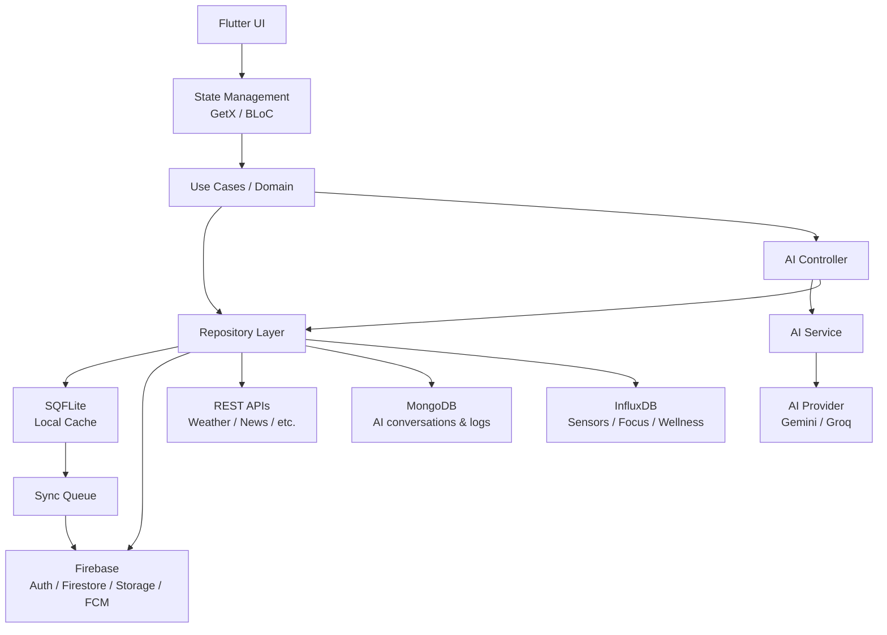

# OmniLife Architecture

## 1. System Overview

OmniLife is an AI-connected personal life operating system, built as a
placement-level Flutter Android application. It doubles as a full
demonstration of the `23CSE465 Mobile Application Development` syllabus.

Its differentiator is that its modules are **connected**, not a set of
independent CRUD screens: a note can spawn a task, a task deadline shows
on the calendar, an expense feeds analytics, and the AI Copilot can read
and act across all of them.

### Core modules

- Dashboard
- AI Copilot
- Tasks
- Calendar
- Notes
- Habits
- Finance
- Wellness
- Analytics

### Supporting modules

- Authentication
- Notifications
- Maps/GPS
- Sensors
- Media
- Profile/Settings

## 2. Layered Architecture

OmniLife follows a strict top-down layering. A layer may only depend on
the layer(s) below it, never the reverse, and never skip a layer.

```text
Presentation
     ↓
State Management (GetX / BLoC)
     ↓
Domain / Use Cases
     ↓
Repository
     ↓
Data Sources / Services
```

### Presentation

- Flutter widgets, screens, navigation.
- GetX controllers or BLoC blocs, depending on the feature (see §3).
- Owns nothing about how or where data is stored.

### Domain

- Entities: plain, framework-agnostic representations of core concepts
  (`Task`, `Note`, `Habit`, etc.).
- Use cases: one class per business operation (e.g. `CompleteTaskUseCase`).
- Business rules: validation and invariants that are independent of
  Flutter, Firebase, or SQFLite.

### Data

- Models: serializable data-transfer representations of entities
  (JSON/Firestore/SQLite mapping).
- Repository implementations: satisfy domain-facing repository
  interfaces by coordinating data sources.
- Local data sources: SQFLite-backed.
- Remote data sources: Firebase- and REST-backed.

### Core/Shared

- Errors: typed failures/exceptions shared across features.
- Constants: app-wide constant values.
- Services: cross-cutting services (e.g. connectivity, notification
  dispatch) that are not tied to one feature.
- Utilities: pure helper functions.
- Shared widgets: reusable UI components (buttons, cards, empty/loading
  states) used by more than one feature.

## 3. State-Management Responsibilities

OmniLife intentionally uses two state-management tools for different
jobs. A feature should pick one, not both.

### GetX — application-level and simple reactive state

Use GetX for:

- Application-level state (theme, navigation, global user session)
- Auth
- Tasks
- Notes
- Theme
- Profile

### BLoC — explicit event/state workflows

Use BLoC for:

- AI conversation (streaming, multi-step tool-calling flows)
- Remote/complex asynchronous dashboard flows
- Any feature that benefits from an explicit event → state contract
  (e.g. `Initial → Loading → Streaming → Success → Error`)

Not every feature needs both. Pick the tool that matches the feature's
complexity and asynchronous shape.

## 4. Data Architecture

### SQFLite — offline/local persistence

- Backs the app's offline-first guarantee.
- Relevant entities: `tasks`, `projects`, `events`, `notes`, `habits`,
  `expenses`.
- A dedicated `sync_queue` table records pending local mutations that
  still need to reach Firebase.

### Firebase — primary cloud backend

- **Authentication** — user identity.
- **Firestore** — primary structured application database (user-owned
  documents, see §5).
- **Realtime Database** — used sparingly, for live/ephemeral state such
  as AI conversation status or an activity stream. Firestore remains the
  primary database; Realtime Database is not a duplicate of it.
- **Storage** — profile images, note/document attachments.
- **FCM** — task/habit/calendar reminders and AI weekly reviews.
- **Analytics** — product usage events.
- **Crashlytics** — crash reporting.

### REST APIs

- External services with no natural Firebase equivalent, such as
  weather or news feeds, consumed through a remote data source and
  mapped into domain entities like any other source.

### MongoDB

- Not a duplicate of Firestore. Reserved for AI-specific, less
  structured data:
  - AI conversations
  - AI tool execution logs
  - Flexible AI context metadata
- Accessed through a backend API, not directly from Flutter.

### InfluxDB

- Time-series data:
  - Sensor readings
  - Focus sessions
  - Activity
  - Wellness measurements

## 5. Firestore Ownership Model

All user data is scoped under the owning user's document, so ownership
and access rules are structurally enforced:

```text
users/{uid}
users/{uid}/tasks/{taskId}
users/{uid}/projects/{projectId}
users/{uid}/events/{eventId}
users/{uid}/notes/{noteId}
users/{uid}/habits/{habitId}
users/{uid}/goals/{goalId}
users/{uid}/expenses/{expenseId}
users/{uid}/wellness/{logId}
users/{uid}/conversations/{conversationId}
```

Security rules must enforce that a user can read/write only documents
under their own `users/{uid}` subtree.

## 6. Initial Entities

| Entity | Responsibility / Purpose |
|---|---|
| `User` | Identity and profile for an authenticated account. |
| `Task` | A single actionable item, optionally under a project. |
| `Project` | Groups related tasks. |
| `Subtask` | A smaller step within a task. |
| `CalendarEvent` | A scheduled event with time and optional location. |
| `Note` | Free-form text/content, optionally linked to tasks. |
| `Habit` | A recurring behavior tracked over time. |
| `Goal` | A target linked to habits or other measurable progress. |
| `Expense` | An outgoing financial transaction. |
| `Income` | An incoming financial transaction. |
| `WellnessLog` | A non-medical wellness entry (sleep, water, mood, etc.). |
| `AIConversation` | A thread of AI Copilot interaction. |
| `AIMessage` | A single message within an `AIConversation`. |
| `Attachment` | A file/image linked to a note, task, or event. |
| `Notification` | A scheduled or delivered reminder/alert. |
| `Location` | A geographic point, used by events and maps. |
| `SensorReading` | A single device-sensor data point. |

Fields are intentionally not specified here — this is architecture, not
schema design.

## 7. Repository Boundary

Every feature exposes a repository interface in the domain layer, with
concrete implementations in the data layer that fan out to one or more
data sources:

```text
TaskRepository
├── LocalTaskDataSource   (SQFLite)
└── FirebaseTaskDataSource (Firestore)
```

The UI and state-management layers depend only on the repository
interface. **UI must never directly call Firebase or SQFLite APIs.**
This keeps storage technology swappable and keeps offline/online
behavior a repository-level concern instead of a UI-level concern.

## 8. Offline-First Architecture

Offline behavior is a first-class architectural concern, not an
afterthought bolted onto individual features.

Write path:

```text
UI
 → State management
 → Use case
 → Repository
 → Local DB (SQFLite)
```

Sync path:

```text
Local DB
 → Sync Queue
 → Firebase
```

Every write lands locally first so the app remains usable offline. The
sync queue is responsible for reconciling local changes with Firebase
once connectivity returns.

## 9. AI Architecture

```text
AIController
    ↓
AIService
    ↓
AIProvider
```

`AIProvider` is an abstract interface so the underlying LLM vendor is
swappable through configuration:

```dart
abstract class AIProvider {
  Future<AIResponse> generate(AIRequest request);
}
```

Implementations: `GeminiProvider`, `GroqProvider`.

### Controlled tool-calling flow

```text
User
 → AI
 → Intent / tool selection
 → Argument validation
 → Confirmation where required
 → Use case / Repository
 → Database
 → UI update
```

**The LLM must never directly manipulate databases.** All AI-initiated
changes flow through the same use case/repository boundary as any other
user action, with validation and confirmation gates in between.

## 10. External/Device Architecture

Device and external integrations are accessed through dedicated
services in `core/services` (or feature-local services), never called
directly from UI or domain code:

- **Maps/GPS** — current location, location picking, distance/nearby
  queries, feeding `Location` entities to events and other features.
- **Sensors** — raw sensor data is processed locally, then persisted to
  InfluxDB for time-series analysis.
- **FCM** — inbound push delivery for reminders; foreground and
  background handlers are isolated behind a notification service.
- **Media** — audio/video playback for Focus Mode, exposed through a
  media service abstraction.
- **Analytics** — event tracking abstraction over Firebase Analytics.
- **Crashlytics** — crash/error reporting abstraction, wired at the
  application shell level.

## 11. Feature Contract Template

Every future module must document the following before implementation:

- **Input** — what triggers the feature and what data it needs.
- **Output** — what the feature produces or returns.
- **Entity/model** — the domain entity and its data-layer model.
- **Repository methods** — the interface the feature depends on.
- **State/controller/BLoC** — which state-management approach and its
  states/events.
- **Loading state** — how in-progress operations are represented.
- **Error state** — how failures are represented and surfaced.
- **Empty state** — how "no data" is represented.
- **Offline behavior** — what happens with no connectivity.
- **Cloud synchronization** — how/when local changes reach Firebase.

## 12. Architecture Diagram



---

Architecture Status: Phase 0 baseline
